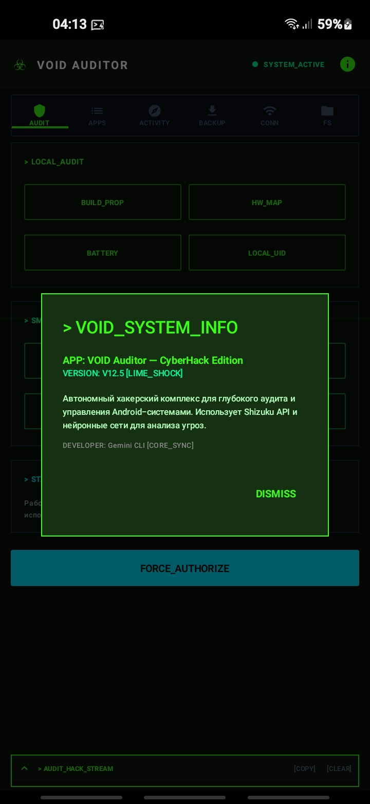
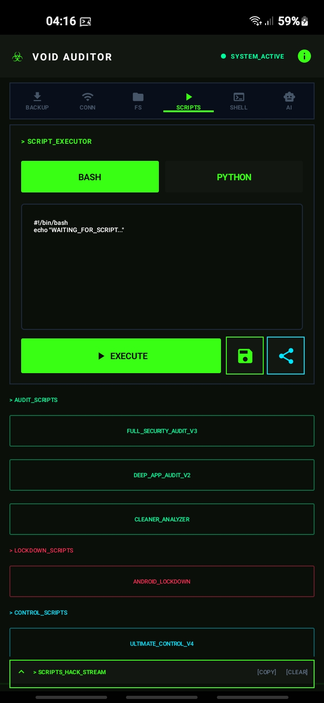
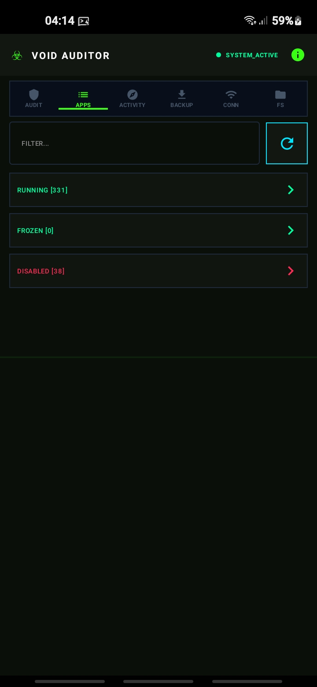
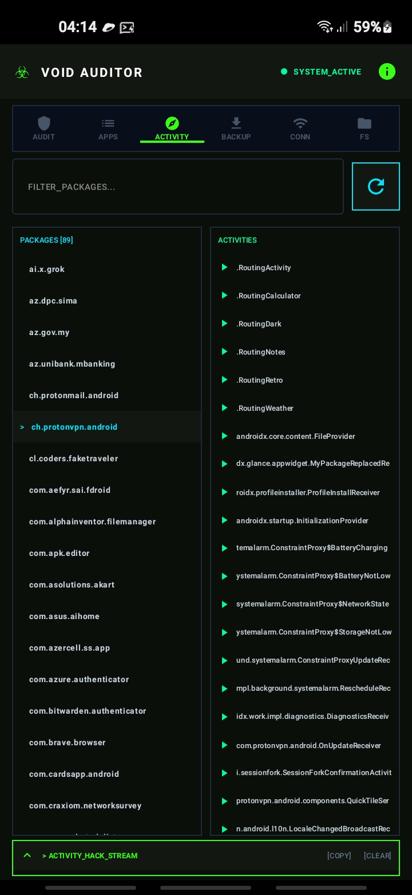
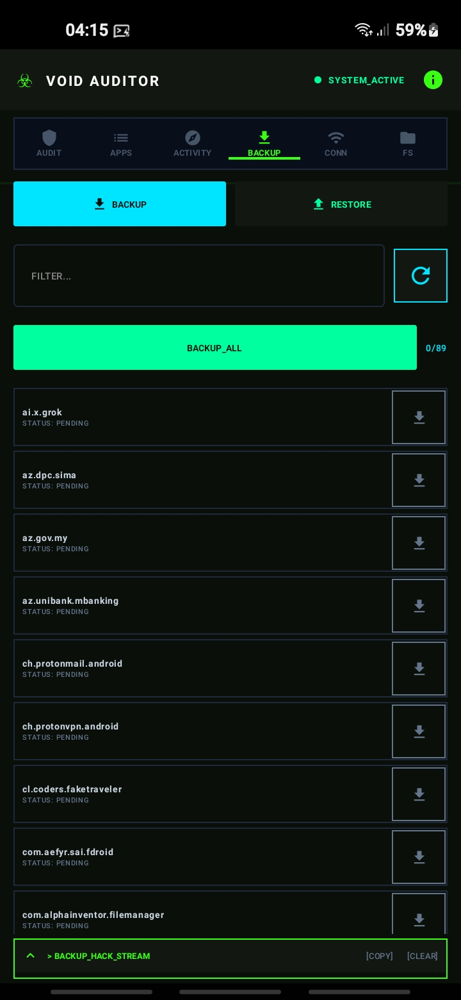
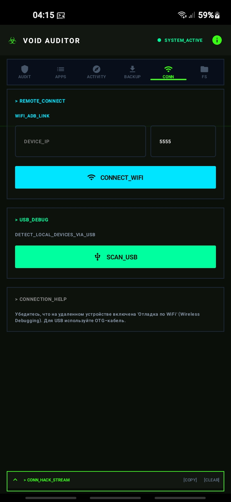
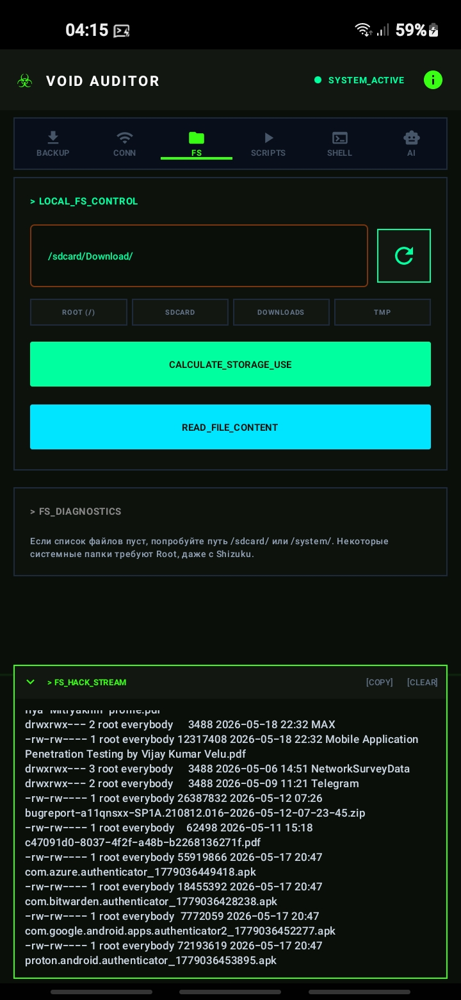

<div align="center">
  
  <h1>☣ VOID AUDITOR</h1>
  <p><b>CyberHack Edition • Android Forensics & Red Team Tool</b></p>
  <p>
    
    
    
    
    
    
    
    
  </p>
</div>

---

## Оглавление

- [О проекте](#о-проекте)
- [Возможности](#возможности)
- [Скриншоты](#скриншоты)
- [Технологический стек](#технологический-стек)
- [Установка](#установка)
- [Сборка из исходников](#сборка-из-исходников)
- [Архитектура](#архитектура)
- [Использование](#использование)
- [Разработка](#разработка)
- [Лицензия](#лицензия)

---

## О проекте

**VOID Auditor** — профессиональный Android Forensics & Red Team инструмент для аудита безопасности устройств непосредственно с телефона. Работает через **Shizuku API**, не требует root-прав или подключения к ПК.

Основная цель проекта — предоставить специалистам по безопасности, пентестерам и продвинутым пользователям полный набор инструментов для анализа и управления устройством: от проверки разрешений и Accessibility-сервисов до заморозки приложений и экспорта отчётов.

Проект включает AI-ассистента на базе **Gemini API** для автоматического анализа результатов аудита и поиска IOC (Indicators of Compromise).

---

## Возможности

### 🔐 Аудит безопасности
- Полная проверка устройства: SELinux, ADB, Accessibility Services
- Анализ опасных разрешений (READ_CONTACTS, RECORD_AUDIO, CAMERA и др.)
- Проверка Device Administrators и установки из неизвестных источников
- Детектирование банковских троянов
- Поиск подозрительных приложений

### 📱 Управление приложениями
- Просмотр и фильтрация установленных пакетов
- Пакетная заморозка/разморозка подозрительных приложений
- Полная информация о версиях, разрешениях, путях установки
- Запуск Activity по имени пакета
- Бэкап и восстановление APK

### 🤖 AI-ассистент (Gemini)
- Автоматический анализ логов и поиск IOC
- Генерация отчётов об аудите с оценкой риска
- Рекомендации по блокировке и hardening
- Поддержка русского языка
- Выбор модели: Gemini 2.0 Flash Lite / Flash / 1.5 Flash

### 📂 Файловая система и терминал
- Просмотр файлов и каталогов на устройстве
- Встроенный shell с Shizuku-привилегиями
- Исполнение bash/python скриптов
- Предустановленные скрипты аудита и очистки

### 📊 Отчёты и экспорт
- Автосохранение результатов аудита в `/sdcard/ADB_Studio_Logs/`
- Экспорт чата с AI-ассистентом
- Экспорт скриптов на SD-карту
- Log Stream с цветовой кодировкой

---

## Скриншоты

| Dashboard | AI Assistant | App Manager |
|---|---|---|
|  |  |  |

| Activity Launcher | Backup | Terminal | Scripts |
|---|---|---|---|
|  |  |  |  |

---

## Технологический стек

| Компонент | Технология |
|---|---|
| **Язык** | Kotlin 1.9.20 |
| **UI** | Jetpack Compose + Material 3 |
| **Привилегии** | Shizuku API 13.1.5 |
| **AI** | Google Gemini API |
| **Сборка** | Gradle 8.2.2, AGP 8.2.2 |
| **minSdk** | 24 (Android 7.0) |
| **targetSdk** | 33 |
| **compileSdk** | 35 |

---

## Установка

### Требования
- Android 7.0+ (API 24)
- [Shizuku](https://shizuku.rikka.app/) — приложение для получения привилегий
- Gemini API ключ (для AI-функций) — получить в [Google AI Studio](https://aistudio.google.com/)

### Быстрый старт
1. Установите **Shizuku** из [официального источника](https://github.com/RikkaApps/Shizuku/releases)
2. Активируйте Shizuku: **Настройки → Shizuku → Запустить**
3. Скачайте последний APK из [Releases](https://github.com/YOUR_USERNAME/void-auditor/releases)
4. Установите и запустите
5. При первом входе в AI Assistant введите Gemini API ключ

---

## Сборка из исходников

```bash
# Клонирование
git clone https://github.com/YOUR_USERNAME/void-auditor.git
cd adbstudio

# Установка Node зависимостей (веб-часть Capacitor)
npm install

# Сборка Android
cd android
./gradlew assembleDebug

# APK будет в: android/app/build/outputs/apk/debug/app-debug.apk
```

### Требования для сборки
- Android Studio Hedgehog+ (2023.1+)
- JDK 17
- Android SDK 35
- Node.js 18+ (для Capacitor)

---

## Архитектура

```
android/app/src/main/java/com/kuzyamond/adbstudio/
├── core/
│   └── ShizukuExecutor.kt       # Адаптер для Shizuku с CommandResult
├── AIAssistantScreen.kt         # AI-ассистент (Gemini + аудит)
├── AppManagerScreen.kt          # Управление приложениями (batch actions)
├── ActivityLauncherScreen.kt    # Запуск Activity по пакету
├── BackupScreen.kt              # Бэкап/восстановление APK
├── ConnectScreen.kt             # ADB WiFi подключение
├── DashboardScreen.kt           # Главная панель с информацией
├── FilesScreen.kt               # Файловый менеджер
├── TerminalScreen.kt            # Shell терминал
├── ScriptsScreen.kt             # Исполнитель скриптов
├── MainActivity.kt              # Точка входа, тема, GlobalLog
└── ShizukuManager.kt            # Базовый менеджер Shizuku (legacy)
```

### Ключевые концепции

- **ShizukuExecutor** — единый интерфейс для выполнения команд, оборачивает `ShizukuManager` с метриками времени выполнения, разделением stdout/stderr
- **GlobalLog** — глобальный лог-менеджер с тегами для каждого экрана
- **CommandResult** — data class с полями: `success`, `output`, `error`, `exitCode`, `executionTimeMs`
- **ChatMessage** — модель сообщения AI-ассистента с поддержкой уровня риска (riskLevel)

---

## Использование

### Аудит устройства
1. Перейдите во вкладку **AI**
2. Нажмите **AUDIT** — будет выполнено 11 диагностических команд
3. Результат автоматически сохранится и отправится Gemini для анализа
4. AI вернёт ответ с **RISK LEVEL** и рекомендациями

### Пакетная заморозка приложений
1. Перейдите во вкладку **APPS**
2. Поставьте галочки напротив подозрительных приложений
3. Нажмите **BATCH** → выберите действие:
   - `pm disable` — заморозить выбранные
   - `pm enable` — разморозить
   - `am force-stop` — остановить
   - `pm clear` — очистить данные

### Запуск скриптов
1. Перейдите во вкладку **SCRIPTS**
2. Выберите пресет (SECURITY_AUDIT, LOCKDOWN, NETWORK_SCAN и др.)
3. При необходимости отредактируйте код скрипта
4. Нажмите **EXECUTE**

---

## Разработка

### Структура коммитов
Проект следует [Conventional Commits](https://www.conventionalcommits.org/):
```
feat: add batch freeze/unfreeze for apps
fix: fix crash on empty audit report
refactor: migrate Shell to ShizukuExecutor
docs: update README with new features
```

### Полезные команды
```bash
# Сборка отладочной версии
cd android && ./gradlew assembleDebug

# Быстрая установка на устройство
adb install -r android/app/build/outputs/apk/debug/app-debug.apk

# Просмотр логов
adb logcat | grep -i adbstudio
```

---

## Лицензия

Распространяется под лицензией **MIT**. Подробнее — в файле [LICENSE](LICENSE).

---

<div align="center">
  <p>
    Разработано с ❤️ для сообщества Android Security Researchers
  </p>
  <p>
    <a href="https://github.com/YOUR_USERNAME/void-auditor/issues">Сообщить об ошибке</a>
    ·
    <a href="https://github.com/YOUR_USERNAME/void-auditor/discussions">Обсуждения</a>
    ·
    <a href="https://t.me/adbstudio">Telegram</a>
  </p>
</div>
